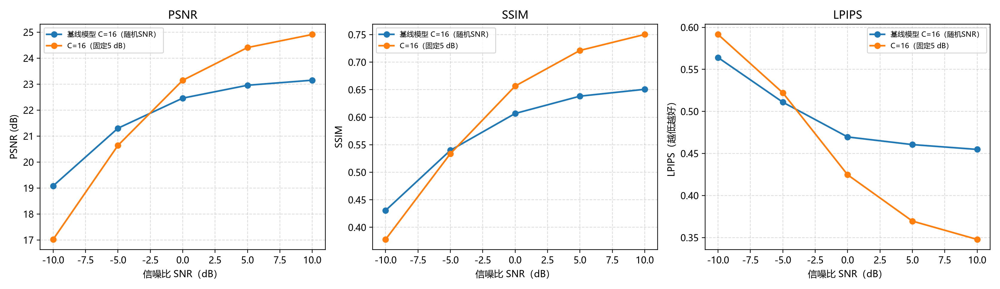

# Deep JSCC Image

基于 PyTorch 的轻量图像语义通信实现，提供从模型训练、信道仿真到重建质量评估的完整流程，可用于研究信噪比、潜特征通道数和训练策略对图像传输性能的影响。

模型使用卷积编码器将图像映射为潜特征，经过加性高斯白噪声（AWGN）信道后，由卷积解码器重建图像。项目支持 Kodak 和 CIFAR-10 数据集，并提供多组对照实验及可视化结果。

## 功能

- **端到端图像传输**：卷积编码、AWGN 信道仿真与图像重建。
- **可复现的数据划分**：固定随机种子，支持 Kodak 训练集与测试集划分。
- **潜特征通道数消融**：比较 C=4、8、16、32 的重建质量和模型复杂度。
- **SNR 训练策略对比**：比较固定 5 dB 与随机 SNR 训练在不同信道条件下的表现。
- **多维度评估**：计算 MSE、PSNR、SSIM、LPIPS、模型参数量及推理时间。
- **结果可视化**：生成性能曲线、重建样例和模型对比图表，导出 CSV 指标。

## 结果展示

基线模型在不同信噪比下的重建质量：


固定与随机 SNR 训练策略对比：



更多图表与指标见 [实验结果](实验结果/)。其中的 PNG 和 CSV 为已有实验记录；重新运行的结果会受到随机噪声、依赖版本和硬件环境的影响。

## 项目结构

代码按实验功能组织，结果目录使用相同名称，便于查找对应的图表和指标。

```text
.
├── 实验运行代码/
│   ├── 基础流程复现/            # 基础训练、评估与绘图
│   ├── 数据划分与基线模型训练/  # Kodak 数据划分、基线模型与公共模块
│   ├── CIFAR-10数据集扩展/      # CIFAR-10 训练与评估
│   ├── 潜特征通道数消融/        # 不同潜特征通道数对比
│   ├── SNR训练策略对比/         # 固定与随机 SNR 对比
│   └── 综合评估与结果分析/      # 指标计算与汇总绘图
├── 实验结果/                   # PNG 图表与 CSV 指标
├── requirements.txt
├── .gitattributes
├── .gitignore
└── README.md
```

各实验目录中的 `README.md` 提供对应的运行说明。数据集和训练权重需在本地准备。

## 安装

使用受所选 PyTorch 版本支持的 Python 环境，例如 Python 3.12。在项目根目录执行：

```powershell
python -m venv .venv
.\.venv\Scripts\Activate.ps1
python -m pip install --upgrade pip
python -m pip install -r requirements.txt
```

Linux/macOS 使用 `python3 -m venv .venv` 创建环境，并通过 `source .venv/bin/activate` 激活。

使用 NVIDIA GPU 时，请先按 [PyTorch 官方安装说明](https://pytorch.org/get-started/locally/) 安装匹配的 `torch` 和 `torchvision`，再安装其余依赖。训练与评估入口支持 `--device auto`、`--device cpu` 和 `--device cuda`。

依赖清单未锁定版本，可用 `python -m pip freeze` 保存实际运行环境。首次下载 CIFAR-10 或加载 LPIPS 预训练主干权重时需要网络连接。

## 数据准备

| 数据集 | 默认路径 | 准备方式 |
|---|---|---|
| Kodak | `实验运行代码/实验数据集/kodak/` | 从 [Kodak 图像集页面](https://r0k.us/graphics/kodak/) 下载 `kodim01.png` 至 `kodim24.png`，直接放入该目录 |
| CIFAR-10 | `实验运行代码/实验数据集/cifar10/` | 首次运行时由 `torchvision` 自动下载，详见 [数据集主页](https://www.cs.toronto.edu/~kriz/cifar.html) |

Kodak 基线默认以随机种子 `42` 将 24 张图像划分为 18 张训练图像和 6 张测试图像。CIFAR-10 使用官方训练集和测试集，下方示例分别抽取 10,000 张和 1,000 张图像。

数据目录相对于项目根目录。训练和评估入口可通过 `--data-dir` 或 `--data-root` 指定其他位置；`create_split.py` 使用默认 Kodak 路径。使用自定义 Kodak 路径时，可直接运行基线训练脚本并传入 `--data-dir`，由训练入口创建划分，后续实验需指定相同数据目录。

## 运行实验

以下命令均在项目根目录执行。

### Kodak 基线

创建固定数据划分，并训练 C=16 的随机 SNR 基线模型：

```powershell
python 实验运行代码/数据划分与基线模型训练/create_split.py
python 实验运行代码/数据划分与基线模型训练/train.py --experiment-name baseline --latent-channels 16 --train-snrs -10 -5 0 5 10 --epochs 200 --device auto
```

### 潜特征通道数消融

完成基线训练后，在相同数据划分下训练 C=4、8、32 三组模型：

```powershell
python 实验运行代码/潜特征通道数消融/run_latent_channels.py --latent-channels 4 8 32 --epochs 200 --device auto
```

### SNR 训练策略对比

训练固定 5 dB 模型，与随机 SNR 基线进行比较：

```powershell
python 实验运行代码/SNR训练策略对比/run_snr_robustness.py --fixed-train-snr 5 --epochs 200 --device auto
```

### 综合评估

完成基线、通道数消融与固定 SNR 模型训练后，统一计算指标并生成汇总图表：

```powershell
python 实验运行代码/综合评估与结果分析/run_metrics_analysis.py --device auto --noise-repeats 5 --benchmark-runs 50
```

该入口加载上述五个模型的本地 `model.pth` 文件，不会重新训练模型。

### CIFAR-10

CIFAR-10 流程可独立运行，入口依次完成训练、评估和绘图：

```powershell
python 实验运行代码/CIFAR-10数据集扩展/run_cifar10.py --epochs 50 --max-train-samples 10000 --max-test-samples 1000 --device auto
```

入口默认训练 200 轮并使用全部样本，上述命令显式指定 50 轮和样本数。已有权重时会跳过训练；修改训练设置后，使用 `--force-train` 重新训练。

### 基础流程

使用全部 24 张 Kodak 图像验证训练、评估和绘图流程：

```powershell
python 实验运行代码/基础流程复现/train.py --epochs 200 --device auto
python 实验运行代码/基础流程复现/evaluate.py --device auto
python 实验运行代码/基础流程复现/plot_results.py
```

该流程不划分训练集与测试集，结果用于验证模型能否正常训练和重建图像，不能作为独立测试集上的泛化性能。Kodak 划分实验的样本量也较小，建议结合 CIFAR-10 结果分析。

## 参数与输出

| 参数 | 含义 | 示例设置 |
|---|---|---|
| `--epochs` | 训练轮数 | Kodak：`200`；CIFAR-10：`50` |
| `--batch-size` | 每批样本数 | Kodak：`4`；CIFAR-10：`128` |
| `--learning-rate` | 学习率 | `1e-3` |
| `--latent-channels` | 潜特征通道数 | 基线：`16`；消融：`4 8 32` |
| `--train-snrs` | 随机训练的 SNR 候选值 | `-10 -5 0 5 10` |
| `--fixed-train-snr` | 固定训练 SNR | `5` dB |
| `--resolution` | 输入图像分辨率 | Kodak：`64`；CIFAR-10：`32` |
| `--device` | 运算设备 | `auto` |
| `--noise-repeats` | 每个 SNR 下的重复传输次数 | 综合评估：`5` |
| `--benchmark-runs` | 推理时间测量次数 | `50` |

各入口支持的参数不同，可运行 `python <脚本路径> --help` 查看；`create_split.py` 不提供命令行参数。

权重、划分文件、日志及新生成的图表默认保存在系统临时目录下的 `deep-jscc-image/`，其子目录与实验名称一致。查看实际位置：

```powershell
python -c "import tempfile; from pathlib import Path; print(Path(tempfile.gettempdir()) / 'deep-jscc-image')"
```

长期实验请备份运行产物，或通过 `--output-dir`、`--output-root` 指定持久目录，并保证后续评估的 `--split-file`、`--checkpoint` 指向对应文件。仓库中的 `实验结果/` 用于展示已有结果，不会随训练自动更新。

从带编号目录的旧版本升级时，需将已有运行产物的实验子目录去掉编号前缀，例如 `02_数据划分与基线模型训练/` 改为 `数据划分与基线模型训练/`，以继续使用原有划分和权重。

## 参考与致谢

- 方法背景：[Deep Joint Source-Channel Coding for Wireless Image Transmission](https://arxiv.org/abs/1809.01733)。本项目采用轻量卷积结构，具体实验配置以代码为准。
- 感知指标：[LPIPS / PerceptualSimilarity](https://github.com/richzhang/PerceptualSimilarity)。
- 基础训练流程参考课程提供的示例代码，并扩展了数据划分、对照实验和指标分析。
- Kodak、CIFAR-10 图像及第三方依赖的权利归各自权利人；重建样例来自对应数据集。
