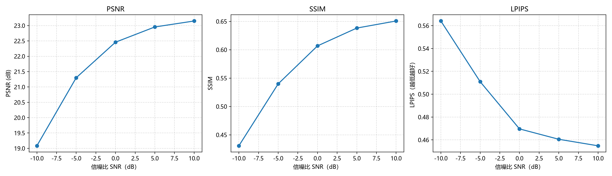

# Deep JSCC Image · 轻量图像语义通信

本项目基于 PyTorch 实现轻量 Deep JSCC 图像语义通信系统，包含 Kodak 基础流程复现、随机 SNR 基线模型训练、CIFAR-10 数据集扩展、潜特征通道数消融、固定/随机 SNR 训练策略对比，以及 LPIPS 与模型复杂度分析。

采用“卷积编码器 → AWGN 信道 → 卷积解码器”的端到端结构，观察信道噪声、潜特征维度和训练策略对图像重建质量的影响。本项目基于课程基础代码扩展，用于学习与实验。

仓库提供实验源码、运行说明，以及整理后的 PNG 图表和 CSV 指标。数据集需自行准备，模型权重需本地训练生成；个人实验报告不纳入发布内容。

## 实验概览

| 实验 | 内容 | 数据与设置 |
|---|---|---|
| 01 | 基础训练、测试与绘图 | Kodak 全部 24 张图像，不划分训练集和测试集 |
| 02 | 固定划分与随机 SNR 基线 | Kodak 18/6 划分，C=16 |
| 03 | CIFAR-10 扩展 | 本文命令使用 10,000 张训练图像、1,000 张测试图像 |
| 04 | 潜特征通道数消融 | C=4、8、32，与 C=16 基线比较 |
| 05 | SNR 训练策略对比 | 固定 5 dB 与随机 SNR 训练 |
| 06 | 综合评估 | MSE、PSNR、SSIM、LPIPS、参数量与运行成本 |

实验 01 用于验证基础流程，不能作为独立测试集上的泛化结果。Kodak 划分实验规模较小，结果应结合 CIFAR-10 扩展一起理解。

## 结果预览




完整图表和指标见 [实验结果目录](02_实验结果/)。这些文件是已有实验的展示快照；重新运行的结果取决于训练设置、随机噪声、依赖版本与硬件。

## 项目结构

目录采用“编号 + 实验目的”的统一命名方式；代码与结果使用相同编号，便于对应查找。

```text
.
├── 03_实验运行代码/
│   ├── 01_基础流程复现/            # 基础训练、测试与绘图
│   ├── 02_数据划分与基线模型训练/  # Kodak 18:6 划分及随机 SNR 基线
│   ├── 03_CIFAR-10数据集扩展/      # CIFAR-10 训练、测试与绘图
│   ├── 04_潜特征通道数消融/        # C=4、8、32 对照实验
│   ├── 05_SNR训练策略对比/         # 固定与随机 SNR 鲁棒性对比
│   └── 06_综合评估与结果分析/      # MSE、PSNR、SSIM、LPIPS 与复杂度
├── 02_实验结果/                   # 按实验整理的 PNG 图表与 CSV 指标
├── .gitattributes                 # 文本换行与二进制文件规则
├── .gitignore                     # 本地文件排除规则
├── requirements.txt               # Python 依赖
└── README.md                      # 总体运行说明
```

`02_实验结果/` 中每个实验对应一个平铺目录，文件名以模型或图表类别作为前缀，避免同名覆盖。各实验的详细说明见对应代码目录中的 `README.md`。

## 1. 环境配置

使用受所选 PyTorch 版本支持的 Python 环境，例如 Python 3.12。在项目根目录创建虚拟环境：

```powershell
python -m venv .venv
.\.venv\Scripts\Activate.ps1
python -m pip install --upgrade pip
python -m pip install -r requirements.txt
```

Linux/macOS 可使用 `python3 -m venv .venv`，再执行 `source .venv/bin/activate`，之后安装同一依赖清单。

若使用 NVIDIA GPU，请先按 [PyTorch 官方安装页面](https://pytorch.org/get-started/locally/) 选择适合本机的 `torch` 和 `torchvision` 安装命令，再安装其余依赖。依赖清单未锁定硬件相关版本；记录复现实验环境时可运行 `python -m pip freeze`。

训练和评估入口支持 `--device auto`、`--device cpu` 和 `--device cuda`；没有 CUDA 时可使用 `--device cpu`。CIFAR-10 下载和首次加载 LPIPS 的预训练主干权重需要网络连接。

## 2. 数据集路径

- **Kodak 数据集**：从 [Kodak 图像集页面](https://r0k.us/graphics/kodak/) 下载 `kodim01.png` 至 `kodim24.png`，放入 `03_实验运行代码/实验数据集/kodak/`。图像应直接位于该目录下。实验 02 默认以种子 `42` 将 24 张图像固定划分为 18 张训练图像和 6 张测试图像。
- **CIFAR-10 数据集**：默认位于 `03_实验运行代码/实验数据集/cifar10/`，用于实验 03。若目录为空或不存在，`torchvision` 会在首次运行时自动下载。数据说明见 [CIFAR-10 官方页面](https://www.cs.toronto.edu/~kriz/cifar.html)。

上述路径相对于项目根目录，数据目录已在 `.gitignore` 中排除。训练和评估入口可通过 `--data-dir` 或 `--data-root` 使用其他位置；`create_split.py` 使用默认 Kodak 路径。自定义 Kodak 路径时，可直接用实验 02 的 `train.py --data-dir <数据目录>` 创建划分并训练，后续入口需指定相同数据目录。

## 3. 训练命令

以下命令均在项目根目录执行。

### 实验 01：基础流程复现

```powershell
python 03_实验运行代码/01_基础流程复现/train.py --epochs 200 --device auto
```

### 实验 02：Kodak 数据划分与随机 SNR 基线模型训练

```powershell
python 03_实验运行代码/02_数据划分与基线模型训练/create_split.py
python 03_实验运行代码/02_数据划分与基线模型训练/train.py --experiment-name baseline --latent-channels 16 --train-snrs -10 -5 0 5 10 --epochs 200 --device auto
```

### 实验 03：CIFAR-10 数据集拓展

```powershell
python 03_实验运行代码/03_CIFAR-10数据集扩展/run_cifar10.py --epochs 50 --max-train-samples 10000 --max-test-samples 1000 --device auto
```

### 实验 04：潜特征通道数消融

```powershell
python 03_实验运行代码/04_潜特征通道数消融/run_latent_channels.py --latent-channels 4 8 32 --epochs 200 --device auto
```

### 实验 05：固定/随机 SNR 训练策略对比

```powershell
python 03_实验运行代码/05_SNR训练策略对比/run_snr_robustness.py --fixed-train-snr 5 --epochs 200 --device auto
```

## 4. 测试与结果分析命令

实验 01 训练完成后，加载本地权重进行测试并绘图：

```powershell
python 03_实验运行代码/01_基础流程复现/evaluate.py --device auto
python 03_实验运行代码/01_基础流程复现/plot_results.py
```

实验 03 的 `run_cifar10.py` 会依次完成训练、测试和绘图。完成实验 02、04、05 的训练后，运行实验 06，计算 MSE、PSNR、SSIM、LPIPS 和模型复杂度并生成汇总图表：

```powershell
python 03_实验运行代码/06_综合评估与结果分析/run_metrics_analysis.py --device auto --noise-repeats 5 --benchmark-runs 50
```

实验 06 需要实验 02、04、05 生成的本地 `model.pth` 文件。仓库不含权重，因此首次运行前必须先完成对应训练。

## 5. 主要参数设置

| 参数 | 含义 | 本文命令使用的设置 |
|---|---|---|
| `--epochs` | 训练轮数 | Kodak：`200`；CIFAR-10：`50` |
| `--batch-size` | 每批样本数 | Kodak：`4`；CIFAR-10：`128` |
| `--learning-rate` | 学习率 | `1e-3` |
| `--latent-channels` | 潜特征通道数 | 基线：`16`；消融：`4 8 32` |
| `--train-snrs` | 训练信道的 SNR 候选值 | `-10 -5 0 5 10` |
| `--fixed-train-snr` | 固定 SNR 训练值 | `5` dB |
| `--resolution` | 输入图像分辨率 | Kodak：`64`；CIFAR-10：`32` |
| `--device` | 运算设备 | `auto` |
| `--noise-repeats` | 每个 SNR 下的重复传输次数 | 实验 06：`5` |
| `--benchmark-runs` | 推理时间测量次数 | `50` |

各入口支持的参数不同，可运行 `python <脚本路径> --help` 查看；`create_split.py` 不提供命令行参数。CIFAR-10 入口的实际默认值为 200 轮、使用全部样本，本文显式指定 50 轮和 10,000/1,000 样本。已有 CIFAR-10 权重时入口会跳过训练，修改训练设置后需加 `--force-train`。

## 6. 如何复现实验结果

1. 按“环境配置”安装依赖，并确认 `03_实验运行代码/实验数据集/kodak/` 可用。
2. 运行实验 02 的数据划分与基线模型训练，生成随机 SNR 基线权重和划分文件。
3. 依次运行实验 04 和实验 05，生成潜特征通道数消融与固定 SNR 对比模型。
4. 运行实验 06，重新计算评价指标并生成汇总图表。
5. 如需复现 CIFAR-10 拓展实验，单独运行实验 03；该入口脚本会自动完成训练、测试和绘图。

训练产生的日志、中间结果和模型权重默认写入系统临时目录下的 `deep-jscc-image/`。可运行以下命令查看实际位置：

```powershell
python -c "import tempfile; from pathlib import Path; print(Path(tempfile.gettempdir()) / 'deep-jscc-image')"
```

系统临时目录可能被清理，长期保存实验时请备份。使用自定义输出目录时，训练和评估的 `--output-dir`、`--output-root`、`--split-file` 或 `--checkpoint` 需对应到同一组产物。`02_实验结果/` 中的展示快照不会随训练自动更新。

## 7. 代码与数据来源

- 基础训练流程来自课程提供的代码，本仓库在此基础上加入数据划分、实验对照和指标分析。
- 方法背景：[Deep Joint Source-Channel Coding for Wireless Image Transmission](https://arxiv.org/abs/1809.01733)。本项目采用轻量卷积结构，实验配置以仓库代码为准。
- 感知指标实现：[LPIPS / PerceptualSimilarity](https://github.com/richzhang/PerceptualSimilarity)。
- Kodak 与 CIFAR-10 图像及第三方依赖的权利归各自权利人；实验重建样例来自对应数据集。

## 8. 提交范围

提交内容为源码、README、依赖清单以及整理后的实验图表和指标。`.gitignore` 排除个人报告及 PDF/Word/LaTeX 写作文件、数据集、模型权重、运行输出、缓存、虚拟环境和本地配置。

`.gitignore` 只影响未跟踪文件，不能移除已有提交中的文件。发布时应检查暂存区；若旧提交包含报告，还需清理相关历史后再推送。
